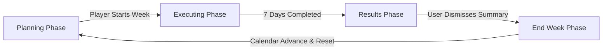
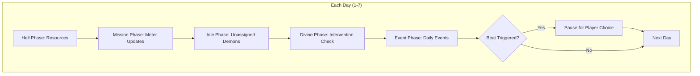

# Week Flow

The core game loop operates on a weekly cycle with distinct phases.

## Phase Sequence

### Phase Overview

| Phase | Duration | Player Role |
|-------|----------|-------------|
| Planning | Until "Execute" clicked | Active decisions |
| Executing | 7 simulated days | React to beats |
| Results | Until dismissed | Review outcomes |
| End Week | Automatic | System cleanup |

## Planning Phase

**What happens:**
- View opportunity cards
- Assign demons to activities (mission/training/quest/etc.)
- Select cult action
- Review intel on targets

**Player actions:**
- Choose targets and approaches
- Manage demon roster
- Spend soul essence

**Exit condition:** Player clicks "Execute Week"

## Executing Phase

**What happens (per day, 7 times):**
1. Process active missions (meter updates)
2. Check for beat triggers
3. Process training progress
4. Process quest progress
5. Check for random events
6. Process autonomous demon behaviors

**Player actions:**
- Respond to beat decisions
- Handle demon demands

## Results Phase

**What happens:**
- Collect end-of-week events
- Display weekly summary
- Show corruption progress
- Present "whispers" (court gossip)

**Player actions:**
- Review outcomes
- Acknowledge events

## End Week Phase

**What happens:**
- Reset weekly flags
- Tick cooldowns
- Process recovery for unpressured characters
- Award weekly income
- Clear temporary state

**Transition:** Automatically returns to PLANNING

## Detailed Phase Breakdown

### Executing Phase Day Loop

## Key Signals

| Signal | Emitter | Purpose |
|--------|---------|---------|
| `phase_changed(phase)` | GameFlow | UI panel switching |
| `day_completed_flow(slot)` | GameFlow | Day progress animation |
| `week_completed_flow(week)` | GameFlow | Results phase trigger |
| `mission_beat_triggered(data)` | SimCoordinator | Beat decision modal |
| `week_execution_paused` | SimCoordinator | Halt for player input |

## Key Components

- [[GameFlow]] - Phase state machine
- [[SimulationPhaseCoordinator]] - Day execution orchestrator
- [[WeekManager]] - Weekly lifecycle and finalization

## Related

- [[Mission System]] - Executes during week
- [[Cult System]] - Actions execute during week
