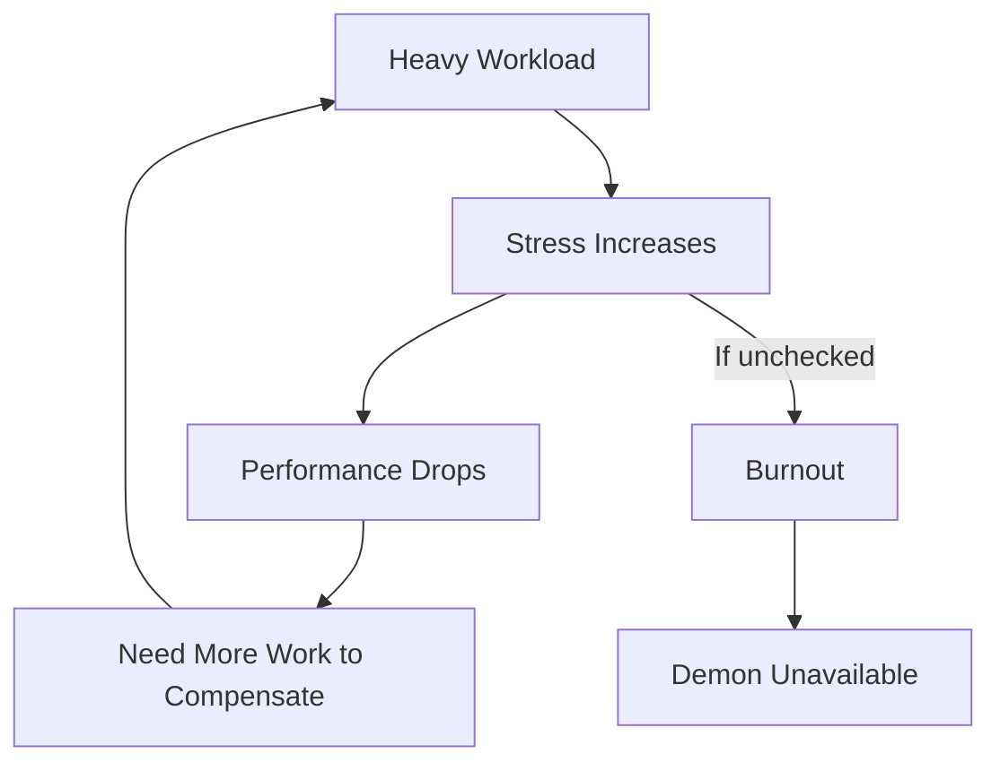

# Demon Economy

Design rationale for demon management, activities, and progression systems.

## Why Mutually Exclusive Activities?

Each demon can do ONE activity per week: Mission, Training, Quest, Exploration, Tournament, or Rest.

### Design Goals

1. **Meaningful Choices** - Every assignment has opportunity cost
2. **Roster Management** - Encourages building diverse demon roster
3. **Pacing Control** - Prevents runaway progression
4. **Strategic Depth** - Balance short-term vs long-term gains

### The Trade-offs

| Choice | Benefit | Cost |
|--------|---------|------|
| Mission | Corruption progress, XP | Energy, stress risk |
| Training | Stat improvement | No XP, no progress |
| Quest | Unique rewards, lore | No corruption progress |
| Exploration | Discoveries, items | Combat risk |
| Tournament | Glory, rewards | High energy cost |
| Rest | Energy recovery | Lost week |

## Demon Specialization

### Why Primary/Secondary Stats?

Demons specialize in 1-2 sins rather than being generalists:

- **Identity** - Each demon feels distinct
- **Strategic Matching** - Match demon to target vulnerability
- **Progression Goals** - Training has clear direction
- **Roster Diversity** - Need multiple demons for multiple targets

### The Archetype System

Personalities affect behavior, not just stats:

| Archetype | Behavior Pattern | Risk Profile |
|-----------|-----------------|--------------|
| Aggressive | Push hard, high damage | Burnout risk |
| Cunning | Subtle, low suspicion | Slower progress |
| Zealous | All-or-nothing | Extreme outcomes |
| Analytical | Calculated, consistent | Predictable |

## Mood and Stress

### Why Mood Matters

Demons aren't tools - they're characters with needs:

1. **Narrative Richness** - Demands, complaints, celebrations
2. **Resource Management** - Can't run demons at 100% forever
3. **Autonomous Events** - Low mood triggers demand events
4. **Relationship Building** - Satisfying demands builds loyalty

### The Stress Spiral

This creates natural pacing pressure.

## Progression Philosophy

### XP Sources

| Source | XP Amount | Design Intent |
|--------|-----------|---------------|
| Mission completion | High | Primary progression path |
| Training | Low | Supplements, doesn't replace |
| Quest completion | Variable | Milestone rewards |
| Tournament victory | Moderate | Risk/reward combat XP |

### Level Benefits

Each level provides:
- +1 stat point to allocate
- Possible verb unlocks
- Increased mission effectiveness

### The Verb System

Verbs are demon abilities that affect mission meters. Design intent:

- **Stat Gates** - Must train to unlock
- **Build Identity** - Verb loadout defines playstyle
- **Strategic Options** - Match verbs to mission needs

## Economy Balance

### Soul Essence Flow

| Source | Rate | Notes |
|--------|------|-------|
| Cult income | Weekly | Scales with cult size/fervor |
| Mission rewards | Per completion | Scales with target importance |
| Corruption stages | Per advancement | Big milestone bonuses |

### Spend Priorities

1. **Demon Recruitment** - Expand roster
2. **Training** - Improve existing demons
3. **Morale Restoration** - Emergency healing
4. **Cover Up** - Reduce intervention risk

## Related

- [[Demon System]] - Implementation details
- [[Mission System]] - Where demons work
- [[Training Activities]] - Stat improvement
- [[Verbs]] - Demon abilities
- [[Economy System]] - Resource management
