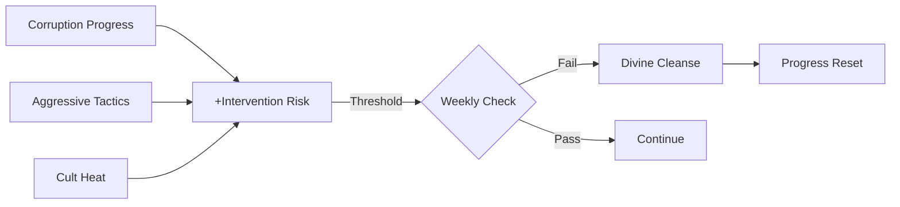

# Risk-Reward Balance

Design rationale for tension, consequences, and player agency in Born Below.

## Core Philosophy

**Every advantage should have a cost. Every risk should have a reward.**

The game constantly asks: "How much are you willing to gamble?"

## The Intervention System

### Why Divine Opposition?

Hell vs Heaven is the cosmic conflict. Divine intervention provides:

1. **Narrative Stakes** - Victory isn't guaranteed
2. **Catch-up Mechanic** - Aggressive play has consequences
3. **Strategic Constraint** - Can't just maximize everything
4. **Tension Arc** - Risk builds toward climactic moments

### Risk Accumulation



### The Psychological Loop

- Early game: Risk feels distant, push hard
- Mid game: Risk accumulates, tension builds
- Late game: Every action feels consequential

## The Mission Slider

### Design Intent

The Pressure/Subtlety slider is the core risk/reward mechanic:

| Setting | Leverage | Suspicion | Moral Fatigue |
|---------|----------|-----------|---------------|
| Subtle (0.0) | Slow (+0.6x) | Safe (+0.3x) | Fast (+1.6x) |
| Aggressive (1.0) | Fast (+1.6x) | Dangerous (+1.9x) | Slow (+0.4x) |

### Strategic Considerations

- **Subtle**: Build moral fatigue first, then push
- **Aggressive**: Race before suspicion triggers intervention
- **Dynamic**: Adjust slider based on mission state

### Why Three Meters?

Single meters create binary gameplay. Three meters create:

- **Trade-offs** - Can't optimize all three
- **Recovery Paths** - High suspicion can be managed
- **Beat Variety** - Different thresholds trigger different narratives

## Beat Decisions

### Philosophy

Beats pause the simulation for meaningful player choice:

| Beat Type | Tension Source | Player Fantasy |
|-----------|----------------|----------------|
| Opportunity | "Push or preserve?" | Calculated gambler |
| Complication | "Fight or flight?" | Crisis manager |
| Breakthrough | "Exploit or build trust?" | Master manipulator |

### Why Choices Matter

Every beat choice has trade-offs:
- **Bold options**: Higher reward, higher risk
- **Safe options**: Lower risk, slower progress
- **Escape options**: Cut losses, preserve resources

No "correct" answer - context determines optimal play.

## Cult Risk Management

### The Heat Mechanic

Cult activities generate Heat (suspicion from authorities):

| Action | Effect | Heat Change |
|--------|--------|-------------|
| Recruit | +Size | +Heat |
| Preach | +Fervor | -Secrecy → +Heat |
| Cover Up | -Heat | Costs resources |

### Strategic Tension

Players must balance:
- **Growth** (more cult power) vs **Safety** (low heat)
- **Short-term** (immediate action) vs **Long-term** (sustainable cult)

## Demon Burnout

### The Fatigue System

Demons aren't infinite resources:

```
Overwork → Stress → Performance Drop → Burnout → Unavailable
```

### Design Intent

- **Roster Rotation** - Can't rely on one demon
- **Recovery Time** - Rest is a real choice
- **Consequence** - Ignoring warnings has cost

## Failure States

### Recoverable vs Terminal

| Failure | Severity | Recovery |
|---------|----------|----------|
| Mission abort | Minor | Try again next week |
| Beat complication | Moderate | Meter setback |
| Divine cleanse | Major | Target progress reset |
| Demon burnout | Moderate | Rest to recover |
| Game over | Terminal | Restart |

### Philosophy

Most failures should be **setbacks, not endings**. Players should feel:
- "I can recover from this"
- "I learned something"
- "Next time I'll play differently"

## Related

- [[Intervention Risk]] - Divine opposition
- [[Mission System]] - Mission risk mechanics
- [[Cult System]] - Cult heat management
- [[Beats]] - Decision points
- [[Week Flow]] - When risks resolve
