# Mission System

The tactical layer connecting demons to corruption targets. Missions run over multiple days with meter-based progression.

## Mission Flow

```mermaid
flowchart LR
    OPP[Opportunity Card] --> LAUNCH[Launch Mission]
    LAUNCH --> DAILY[Daily Execution]
    DAILY --> BEAT{Beat Threshold?}
    BEAT -->|Yes| CHOICE[Player Choice]
    CHOICE --> DAILY
    BEAT -->|No| CHECK{Leverage ≥80?}
    CHECK -->|No| DAILY
    CHECK -->|Yes| COMPLETE[Mission Complete]
    COMPLETE --> REWARDS[Apply Rewards]
```



### Daily Execution Sequence


## Mission Meters

Three meters track mission state (0-100 scale):

| Meter | Purpose | Goal | Zone Thresholds |
|-------|---------|------|-----------------|
| **Leverage** | Progress toward corruption | Higher = better | 20/40/60/80 |
| **Suspicion** | Target awareness | Lower = better | 20/40/60/80 |
| **Moral Fatigue** | Target's resistance erosion | Higher = better | 20/40/60/80 |

### Pressure/Subtlety Slider

The slider (0.0 to 1.0) controls risk vs reward:

| Slider | Leverage | Suspicion | Moral Fatigue |
|--------|----------|-----------|---------------|
| Subtle (0.0) | 0.6x | 0.3x | 1.6x |
| Balanced (0.5) | 1.1x | 1.1x | 1.0x |
| Aggressive (1.0) | 1.6x | 1.9x | 0.4x |

## Daily Execution

Each day of the week:
1. Calculate demon effectiveness
2. Apply pressure to target
3. Update mission meters
4. Check for beat thresholds
5. Check for mission completion

## Beats

Beats are narrative decision points triggered when meters hit thresholds:

| Beat Type | Trigger | Player Choice |
|-----------|---------|---------------|
| Opportunity | High leverage | Push advantage or play safe |
| Complication | High suspicion | Cover tracks or press on |
| Breakthrough | High fatigue | Exploit weakness or build trust |

## Mission State

```gdscript
MissionStateData:
  - mission_id: String
  - target_id: String
  - demon_id: String
  - sin_focus: String
  - meters: {leverage, suspicion, moral_fatigue}
  - available_beats: Array
```

## Key Components

- [[CorruptionFacade]] - Mission lifecycle
- [[MissionExecutorService]] - Daily updates
- [[MissionMeterService]] - Meter calculations
- [[MissionBeatService]] - Beat detection
- [[MissionRewardService]] - Completion rewards

## Related Systems

- [[Corruption System]] - What missions affect
- [[Demon System]] - Who runs missions
- [[Beats]] - Decision points

---

## See Also

### Design
- [[Risk-Reward Balance]] - Slider and beat philosophy
- [[Corruption Philosophy]] - Pressure and desperation

### Development
- [[Adding a New Scheme]] - Creating new missions
- [[Common Patterns]] - Code patterns

### Content
- [[Corruption Schemes]] - All scheme definitions
- [[Mission Beats]] - Beat content
- [[Verbs]] - Demon abilities affecting meters
